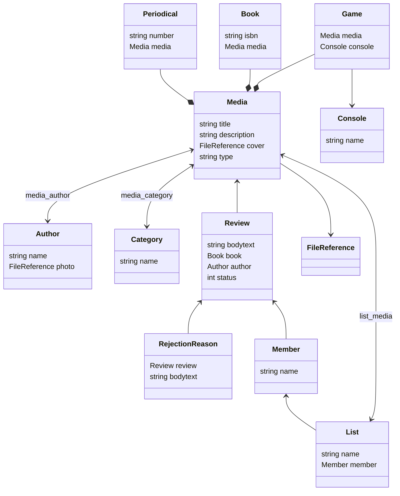

# Class diagram

```mermaid
classDiagram

    class Media {
        string title
        string description
        FileReference cover
        string type
    }

    class Book {
        string isbn
        Media media
    }

    class Periodical {
        string number
        Media media
    }
    
    class Game {
        Media media
        Console console
    }
    
    class Console {
        string name
    }

    class Author{
        string name
        FileReference photo
    }

    class Category {
        string name
    }

    class Review {
        string bodytext
        Book book
        Author author
        int status
    }

    class RejectionReason {
        Review review
        string bodytext
    }

    class Member {
        string name
    }

    class List {
        string name
        Member member
    }

    class FileReference {

    }

    Periodical --* Media
    Book --* Media
    Game --* Media
    Media <--> Author : media_author
    Media <--> Category : media_category
    Media --> FileReference
    Media <-- Review
    Review <-- RejectionReason
    Review <-- Member
    Member <-- List
    Media <--> List : list_media
    Game --> Console
```
